# AiOps

定位为**AI时代**，公司内部的**自助式**轻应用运维部署平台,旨在**解决非技术团队**个人利用AI开发的**简易系统**，快速迭代上线，类似于**简化版的Vercel**。

### 系统架构图

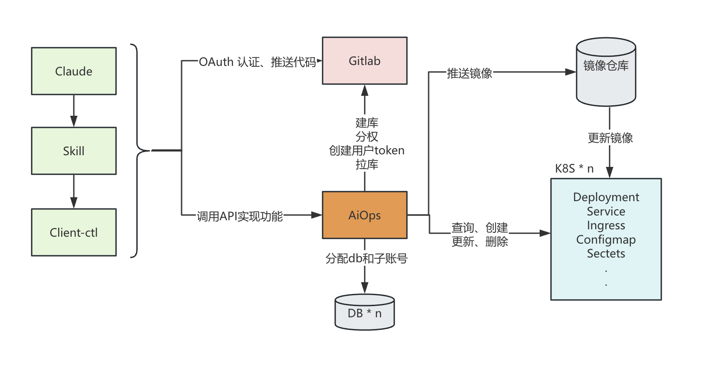

[扩展Api文档](external-api.md)

---

### 系统首页

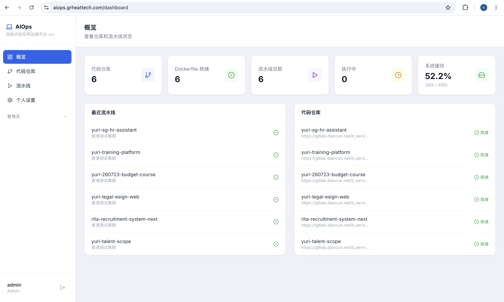

---

### 代码仓库页

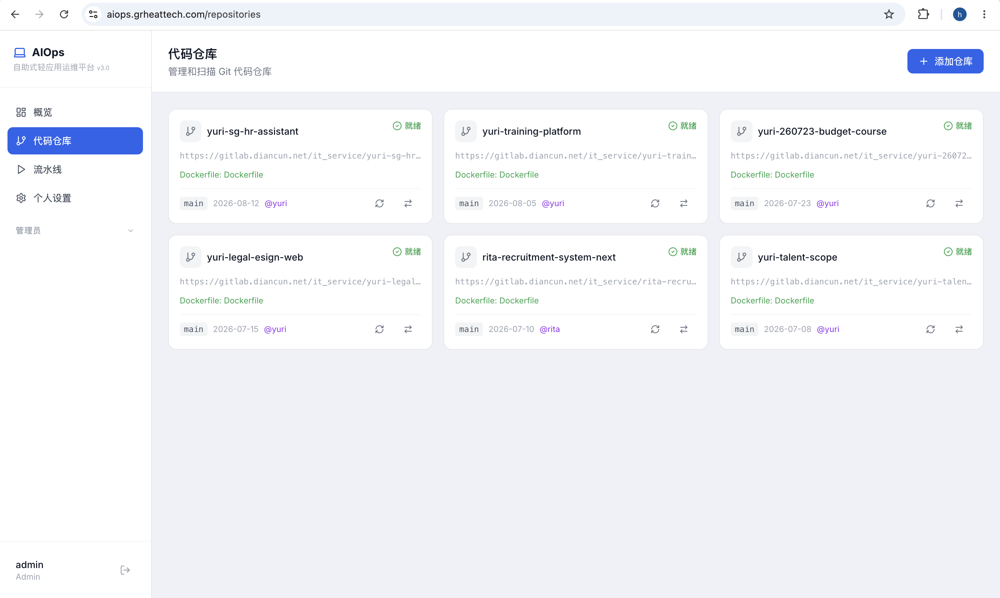

---

### 流水线页

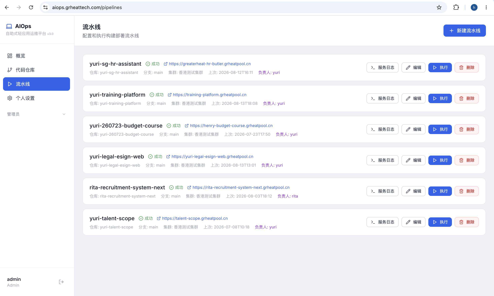

---

### 流水线详情页

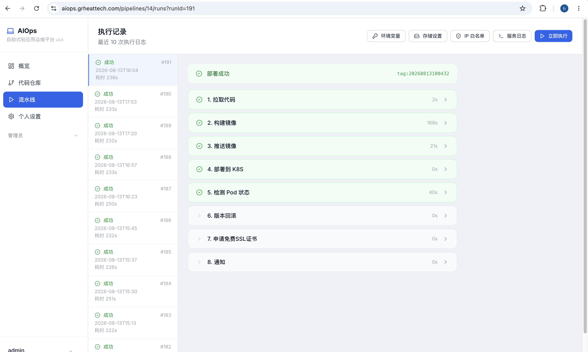

---

### 流水线环境变量配置（configmap）

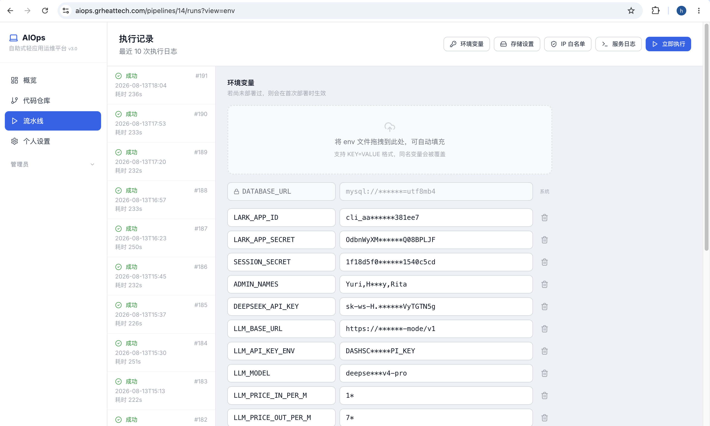

---

### PVC存储对接

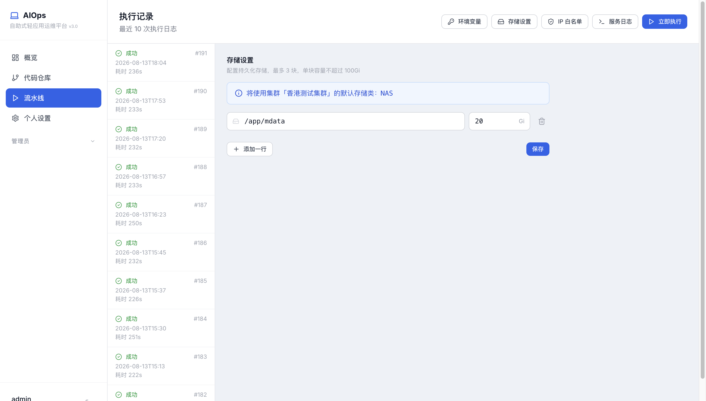

---

### 白名单设置（ingress 安全策略）

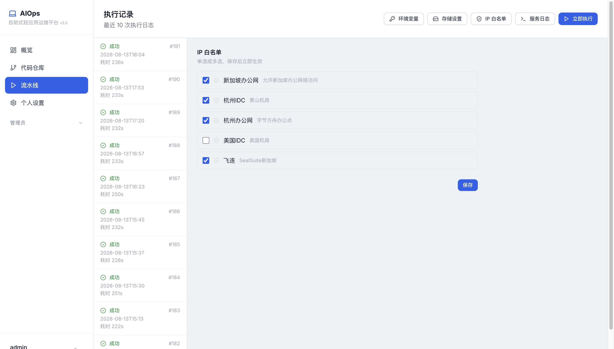

---

### 应用日志实时查看（kubectl logs）

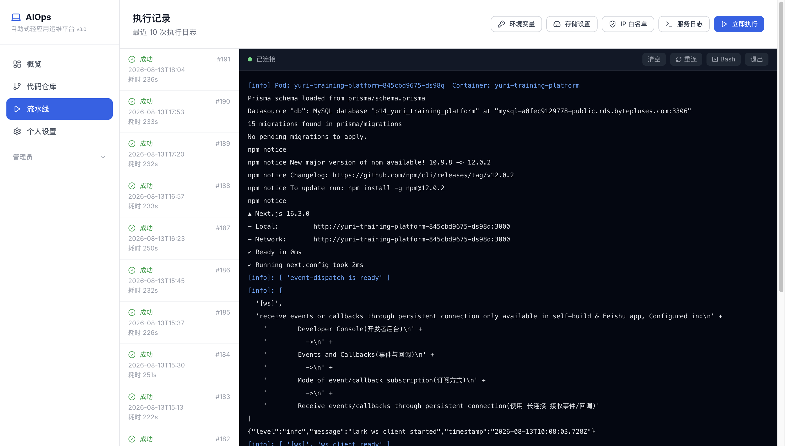

---

### 应用远程shell (kubectl exec)

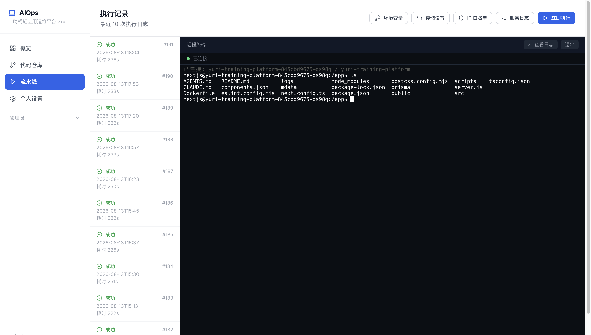

---

### 系统管理员功能

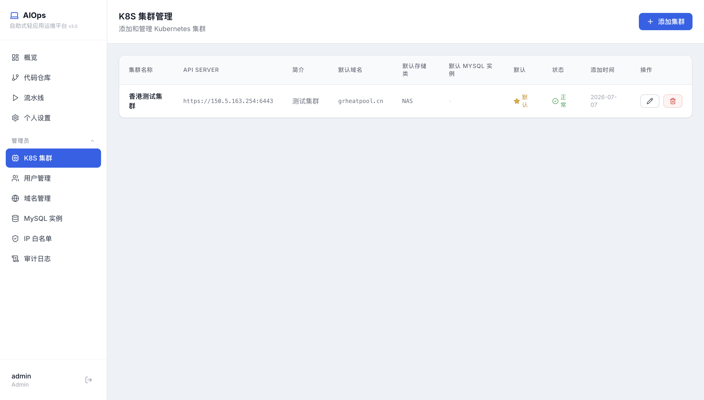

---

### 客户端运行效果

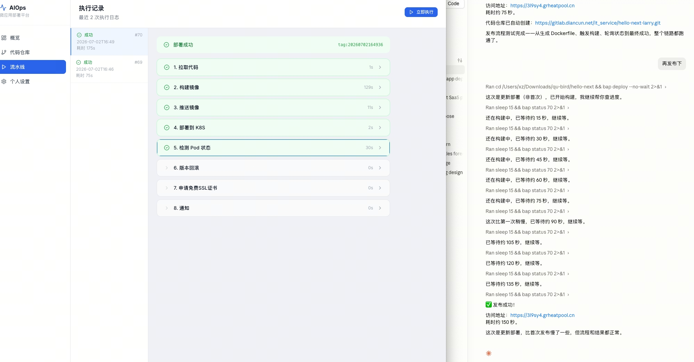